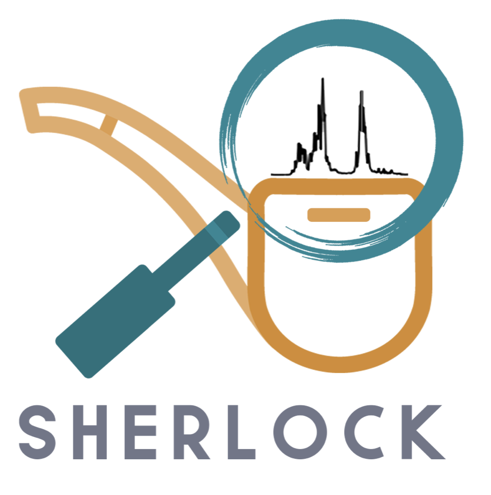

 
  

# Sherlock
Web services for Computer-Assisted Structure Elucidation (CASE).

A [graphical user interface](https://github.com/michaelwenk/sherlock-frontend) and [publication](https://doi.org/10.3390/molecules28031448) are available.

## Core  Features
- Dereplication
- Elucidation
- Retrieval of previously generated results 

The dereplication, chemical shift prediction and statistical detection of structural constraints are enabled by using entries from NMRShiftDB and COCONUT containing structural and spectral properties. Spectra in use are both experimental and predicted.  

[casekit](https://github.com/michaelwenk/casekit) serves as computational library within Sherlock.

[PyLSD](https://github.com/nuzillard/PyLSD) is used for structure generation. 
<!---
See [Dependencies](#dependencies) section.
-->

## Docker and Execution of pre-built Containers
This project uses Docker containers (https://www.docker.com) and starts them via docker-compose. Make sure that docker-compose is installed.

NOTE: It is recommended to set the accessible RAM to 6 GB or higher and the number of available CPU cores to two. This can be done easily in the Docker Desktop application, see [here](/public/Docker_settings.png).

### Download
Clone this repository and change the directory:
 
    git clone https://github.com/michaelwenk/sherlock.git
    cd sherlock

Now pull all the containers needed for execution from Docker Hub:

     docker-compose -f docker-compose.yml -f docker-compose.publish.yml pull

### Create and Start
To create the network and start the services for the first time (in detached mode) use:

    docker-compose -f docker-compose.yml -f docker-compose.publish.yml up -d

Note: It will take several minutes until all services are available and registered, i.e. due to the extraction of the compressed fragment data.

If the container network was already created beforehand and stopped via "stop" command, then the "start" command can be used. 
This will avoid extracting the fragments again and the services should be ready within a few seconds.

    docker-compose -f docker-compose.yml -f docker-compose.publish.yml start

### Stop and Removal
To stop the application use:

    docker-compose -f docker-compose.yml -f docker-compose.publish.yml stop

If the removal of the network created by docker-compose is desired, then use the down command:

    docker-compose -f docker-compose.yml -f docker-compose.publish.yml down

<!---
## Self Compilation and Dependencies

### Compilation
CASEkit (https://github.com/michaelwenk/casekit) has to be downloaded and compiled beforehand.

Now add the jar file to the local Maven repository by following command:

(note: replace "PATH/TO/CASEKIT-JAR-WITH-DEPENDENCIES" by the path to previously built CASEkit jar):

    mvn install:install-file -Dfile=PATH/TO/CASEKIT-JAR-WITH-DEPENDENCIES -DgroupId=org.openscience -DartifactId=casekit -Dversion=1.0 -Dpackaging=jar

Clone this repository:

    git clone https://github.com/michaelwenk/sherlock.git

Change the directory and build all the .jar files needed for this project using the build shell script:

    cd sherlock
    sh buildJars.sh

### Dependencies
Some services rely on specific software or file dependencies which has to be downloaded and put into certain places.
#### PyLSD
For the structure generation part PyLSD (http://eos.univ-reims.fr/LSD/JmnSoft/PyLSD/) is needed.
PyLSD can be downloaded from http://eos.univ-reims.fr/LSD/JmnSoft/PyLSD/INSTALL.html.

Extract and rename the new PyLSD folder to "PyLSD", if needed.

Now put the PyLSD folder into 

    backend/sherlock-pylsd/data/lsd/

In case custom filters are desired to use one can create a folder "filters" in

    backend/sherlock-pylsd/data/lsd/

and put the custom filters there. The system will use them automatically.

For more details about LSD and defining substructures and filters see http://eos.univ-reims.fr/LSD/MANUAL_ENG.html#SSTR .

#### NMRShiftDB
For the dereplication, automatic hybridization detection und chemical shift prediction via HOSE codes the NMRShiftDB (https://nmrshiftdb.nmr.uni-koeln.de) is required.

Download the "nmrshiftdb2withsignals.sd" from https://sourceforge.net/projects/nmrshiftdb2/files/data/ and copy it into 

    backend/sherlock-db-service-dataset/data/nmrshiftdb/

and rename the file to "nmrshiftdb.sdf". 

### Docker and Application Start/Stop
This project uses Docker containers (https://www.docker.com) and starts them via docker-compose. Make sure that docker-compose is installed.

#### Build
To build the container images use the following command:

    docker-compose -f docker-compose.yml -f docker-compose.production.yml build

#### Start 
To start this application (in detached mode) use

    docker-compose -f docker-compose.yml -f docker-compose.production.yml up -d

Note: It can take a few minutes until all services are available and registered.

#### Stop
To stop this application use

    docker-compose -f docker-compose.yml -f docker-compose.production.yml down

### Docker Container and Data Preparation/Persistence
The databases for datasets and hybridizations have to be filled when starting the application the first time.

After that procedure, the container database contents are stored in the "data/db" subdirectory of each "db-instance" service.
That enables the persistence of database content to access the data whenever the database services are restarting.

#### Dataset
For dataset creation and insertion use:

    curl -X POST -i 'http://localhost:8081/sherlock-db-service-dataset/replaceAll?nuclei=13C'

This will fill-in datasets with 13C spectra only. If multiple nuclei are desired, 
then this could be done by adding them separated by comma, e.g. 13C, 15N: 

    curl -X POST -i 'http://localhost:8081/sherlock-db-service-dataset/replaceAll?nuclei=13C,15N'

One can then check the number of datasets:

    curl -X GET -i 'http://localhost:8081/sherlock-db-service-dataset/count' 

#### Statistics
As for datasets we need to build the hybridization and connectivity statistics and can decide which nuclei to consider:

    curl -X POST -i 'http://localhost:8081/sherlock-db-service-statistics/hybridization/replaceAll?nuclei=13C'
    curl -X POST -i 'http://localhost:8081/sherlock-db-service-statistics/connectivity/replaceAll?nuclei=13C'

To check the number of hybridization/connectivity entries:

    curl -X GET -i 'http://localhost:8081/sherlock-db-service-statistics/hybridization/count'
    curl -X GET -i 'http://localhost:8081/sherlock-db-service-statistics/connectivity/count'

#### HOSE Codes
One needs to insert the HOSE code information as well:

    curl -X POST -i 'http://localhost:8081/sherlock-db-service-hosecode/replaceAll?nuclei=13C&maxSphere=6'

To check the number of HOSE code entries:

    curl -X GET -i 'http://localhost:8081/sherlock-db-service-hosecode/count'

For spectra prediction a map of HOSE code and assigned statistics is needed. 
Due to this one now needs to execute following command to store such map in a shared volume:

    curl -X GET -i 'http://localhost:8081/sherlock-db-service-hosecode/saveAllAsMap'

-->

